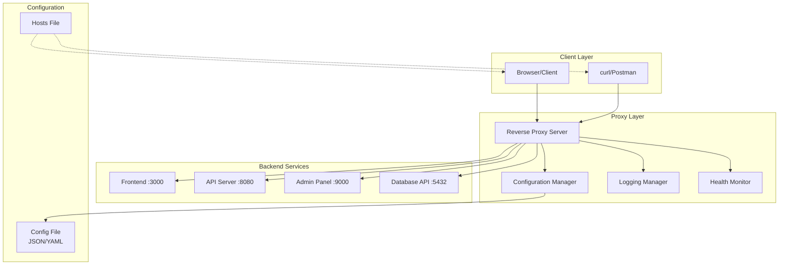
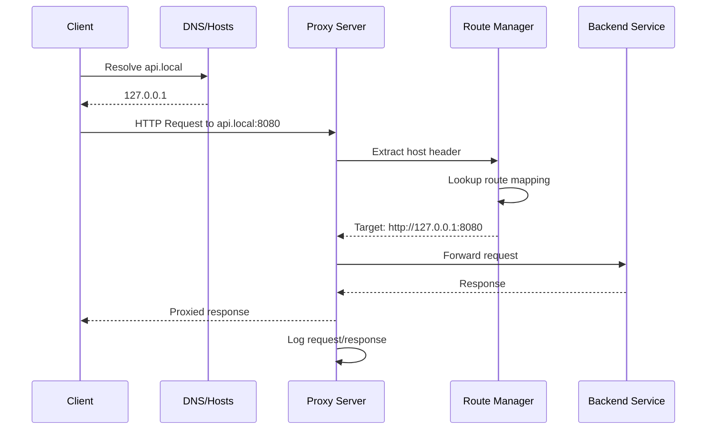
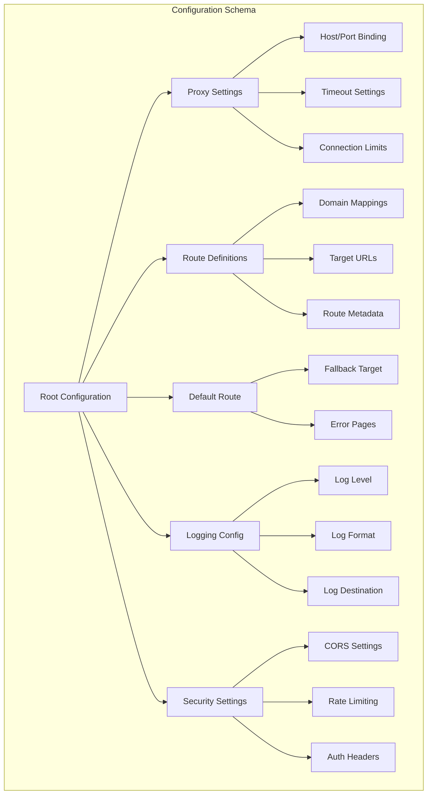
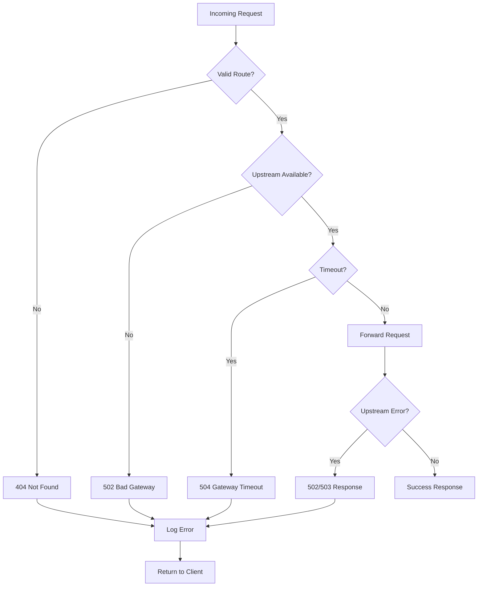

# Python Reverse Proxy Tool Specification

## 1. Overview

### 1.1 Purpose

A high-performance, configuration-driven reverse proxy tool built in Python that enables developers to easily route HTTP requests from custom domain names to different backend services running on localhost ports.

### 1.2 Key Objectives

- **Simplicity**: Single configuration file setup
- **Performance**: Fast localhost routing
- **Ease of Use**: Minimal setup for local development

### 1.3 Target Use Cases

- Local development environment setup
- Simple routing between local services

## 2. System Architecture

## 3. Request Flow Architecture

## 4. Configuration Specification

### 4.1 Configuration Structure

### 4.2 Configuration Format

- **JSON format** for simple, widely supported configuration

### 4.3 Configuration Validation Rules

- **Required Fields**: `proxy.port`, `routes`, `default.target`
- **Optional Fields**: All logging, security, and advanced settings
- **Port Validation**: 1-65535 range, privilege warnings for <1024
- **URL Validation**: Valid HTTP/HTTPS URLs for targets
- **Host Validation**: Valid domain names or IP addresses

## 5. Core Features Specification

### 5.1 Routing Engine

- **Host-based routing** via HTTP Host header
- **Simple domain to port mapping**

### 5.2 Connection Management

- **Basic connection handling** for localhost services
- **Simple error handling** for unavailable backends

### 5.3 Basic Monitoring

- **Simple status endpoint** for proxy health
- **Basic logging** of requests and errors

## 6. Performance Specifications

### 6.1 Performance Targets

| Metric | Target |
| :-- | :-- |
| Request Latency | Fast localhost routing |
| Memory Usage | Minimal footprint |
| Configuration Reload | Quick hot reload |

### 6.2 Architecture

- **Simple async I/O** for handling requests
- **Basic request processing** for local development

## 7. Security Specification

### 7.1 Security Features

- **Basic input validation** for requests
- **Simple header handling** for local development

### 7.2 Security Controls

- **Basic request validation** for local development
- **Simple error handling** for malformed requests

## 8. Error Handling Architecture

### 8.1 Error Categories

- **Configuration Errors**: Invalid config, missing files
- **Network Errors**: Connection failures, timeouts
- **Upstream Errors**: Backend service failures

## 9. Command Line Interface

### 9.1 CLI Commands

| Command | Purpose | Example |
| :-- | :-- | :-- |
| `start` | Start proxy server | `proxy start` |
| `validate` | Validate configuration | `proxy validate` |

### 9.2 CLI Options

| Option | Description | Default |
| :-- | :-- | :-- |
| `--config`, `-c` | Configuration file path | `config.json` |
| `--port`, `-p` | Override proxy port | From config |
| `--host`, `-h` | Override bind host | From config |

## 10. Local Development Setup

### 10.1 Installation

- **pip install** for Python ecosystem integration
- **Direct Python execution** for quick testing
- **Git clone** for development and customization

### 10.2 Usage

- **Non-privileged ports** (1024+) for easy local testing
- **Local configuration files** for route definitions
- **Direct command line execution** for immediate feedback
- **Hot reload** for configuration changes during development

## 11. Monitoring and Observability

### 11.1 Basic Metrics

- **Request count** and status codes
- **Simple error logging**

### 11.2 Logging Standards

- **Simple request logging** with basic information
- **Error logging** for debugging

This specification provides a comprehensive blueprint for building a production-ready, high-performance reverse proxy tool that balances simplicity with powerful features, making it suitable for both development and production environments.

